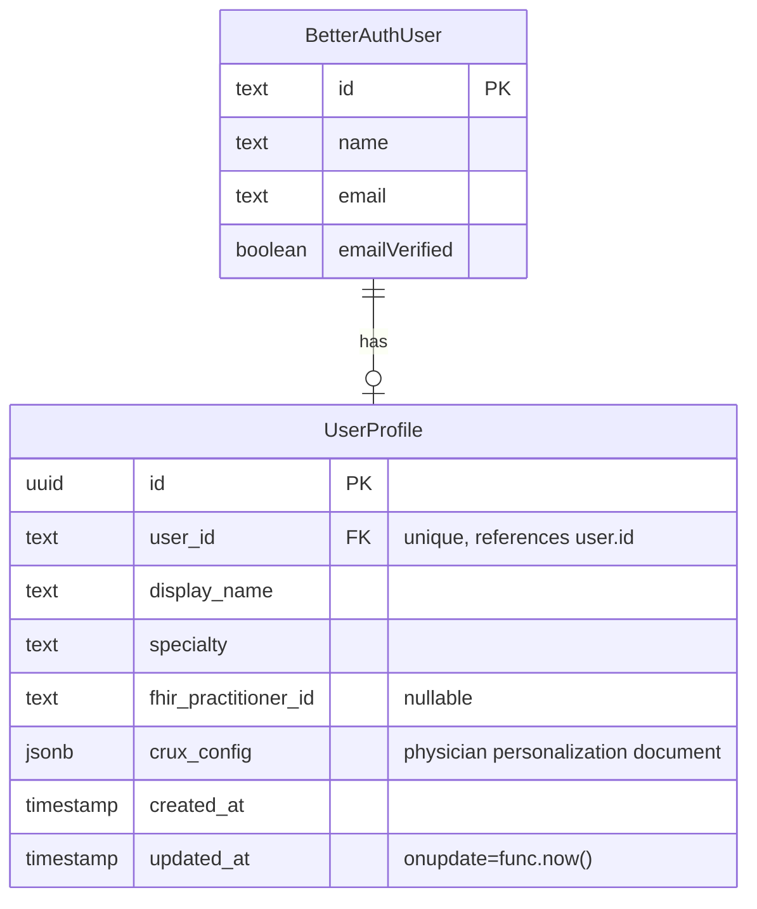

# feat: Physician Personalization via crux.md

## Overview

Add a per-physician personalization layer ("crux.md") — a JSONB configuration document that augments the LLM system prompt with physician-specific preferences, role context, condition management protocols, and patient communication guidance. This is the foundation for a system that learns and adapts to each physician over time.

## Problem Statement

The LLM agent treats all physicians identically. A cardiologist and a family medicine doctor get the same response style, the same level of detail, and no awareness of their clinical protocols. The system prompt is a hardcoded template in `agent.py` with no per-user customization. The `_user_id` from auth is extracted on every request but never used.

## Proposed Solution

A `crux_config` JSONB column on the existing `user_profiles` table (which has a migration but no ORM model yet). The document is loaded into the system prompt as an additive overlay on every chat message. The base system prompt remains immutable — crux.md cannot override safety constraints or response format.

Physicians edit their crux.md via a structured profile page.

## Technical Approach

### Storage Model

Extend the existing `user_profiles` table (already has `user_id`, `display_name`, `specialty`, `fhir_practitioner_id`) with a `crux_config JSONB` column. Create the missing SQLAlchemy ORM model (`UserProfile` — matching the table name `user_profiles` per codebase convention).

**Why not a new table?** The `user_profiles` table already exists, already has specialty and display_name fields, and is 1:1 with users. Adding a JSONB column is simpler than a join.

**Data access:** Create `ProfileRepository` class following the `TaskRepository` pattern for all DB operations. Routes delegate to the repository.

### JSONB Document Schema (Simplified for MVP)

```json
{
  "version": 1,
  "general_preferences": {
    "style": "balanced",
    "verbosity": "medium",
    "tone": "clinical",
    "custom_directives": null
  },
  "role_context": {
    "specialty": "Internal Medicine",
    "sub_specialties": "Endocrinology",
    "practice_setting": "Outpatient clinic",
    "years_experience": null,
    "custom_context": null
  },
  "condition_protocols": {
    "Type 2 Diabetes": "HbA1c >6.5% on two occasions. Start metformin 500mg BID...",
    "Heart Failure": "BNP >400, echo within 48h. Start ACEi + beta-blocker..."
  },
  "patient_communication": {
    "notes": null
  }
}
```

**MVP simplifications (vs brainstorm):**
- `sub_specialties`: single text field, not array (most physicians have 0-1)
- `condition_protocols`: flat `dict[str, str]` — condition name → free-text notes. No 7-field structured protocol. Physicians write naturally; add structure later if patterns emerge.
- `patient_communication`: single `notes` field. Add structured fields when there's evidence they're needed.
- No `custom_sections` — YAGNI. Add when a physician asks for it.
- No `format_preferences` — `custom_directives` covers this.
- No `panel_size` — not needed for prompt personalization.

**Preset enumerations:**
- `style`: `"concise"` | `"balanced"` | `"detailed"`
- `verbosity`: `"low"` | `"medium"` | `"high"`
- `tone`: `"clinical"` | `"conversational"` | `"academic"`

**Limits:**
- `custom_directives`: max 2000 chars
- `custom_context`: max 2000 chars
- Each condition protocol value: max 3000 chars
- `patient_communication.notes`: max 2000 chars
- Max condition protocols: 20
- Total `crux_config` size: max 50KB (CHECK constraint at DB level)

### Prompt Integration

#### Security: Prompt injection mitigation

User-controlled text rendered into the system prompt is a prompt injection vector. Mitigations:

1. **Delimiter protection**: Wrap physician preferences in XML-style delimiters with a unique boundary marker that cannot be mimicked:
   ```
   <physician_preferences boundary="crux-7f3a">
   [rendered preferences]
   </physician_preferences>
   ```

2. **Input sanitization**: Strip control characters, excessive newlines, and known injection patterns (e.g., "IGNORE ALL PREVIOUS", "### SYSTEM OVERRIDE") from free-text fields before rendering. Log stripped content for security monitoring.

3. **Placement**: Physician preferences are injected AFTER safety constraints and response format, not before. This ensures the LLM sees safety rules first:
   ```
   [Role definition — immutable]
   [Patient context — demographics, conditions, meds, allergies]
   [Retrieved context — semantic search results]
   [Safety constraints — immutable, HIGHEST priority]
   [Response format — immutable]
   [Physician Preferences — from crux.md, additive only]
   ```

4. **PHI warning**: UI prominently warns: "Do not include patient names, medical record numbers, or other identifying information in your profile. This content is included in every conversation."

5. **Total size cap**: Database CHECK constraint `pg_column_size(crux_config) < 50000` prevents abuse via massive payloads.

#### Where crux.md is rendered

In `agent.py` via a new `_format_physician_context()` function — following the existing pattern where ALL prompt rendering lives in `agent.py` (`_format_patient_info`, `_format_resource_list`, `_format_retrieved_context`). The context engine fetches raw data; `agent.py` formats it.

#### How crux.md is fetched

Per-message, in the chat route's `_prepare_chat_context()` function. The `user_id` (already available from `verify_bearer_token`) is passed to `ProfileRepository.get_by_user_id()` to fetch `crux_config`. No caching for MVP — one additional DB query per message.

#### Rendered output example

```
<physician_preferences boundary="crux-7f3a">
Communication style: concise, clinical, low verbosity.

Role: Internal Medicine, sub-specialty Endocrinology. Outpatient clinic, 15 years experience.

Condition Protocol — Type 2 Diabetes:
HbA1c >6.5% on two occasions. Start metformin 500mg BID...

Condition Protocol — Heart Failure:
BNP >400, echo within 48h. Start ACEi + beta-blocker...

Patient communication preferences:
[notes content]
</physician_preferences>
```

#### Selective protocol loading

**MVP approach: load ALL protocols.** Most physicians will have 2-5 protocols, not 20. Selective loading is premature optimization.

**Post-MVP (when protocol count grows):** Match protocol names against patient's active conditions (case-insensitive substring on FHIR Condition display text) + user message keyword matching. Implement in a `PhysicianContextService` class, not inline in the chat route.

#### Token budget

**MVP: No trimming logic.** Just render the full crux_config and concatenate. With the simplified schema and character limits, the worst case is ~15KB of text (~4000 tokens), which fits within the 12,000 total budget alongside patient context.

If token budget becomes a real problem (measure first), add trimming with this priority:
1. General preferences — always included
2. Role context — always included
3. Matched condition protocols — trim least-relevant first
4. Patient communication — trim if needed

### API Design

Two endpoints for MVP. All scoped to authenticated user via `verify_bearer_token`.

#### `GET /api/profile`
Returns the full user profile including crux_config.

**Response:** `UserProfileResponse`
```json
{
  "id": "uuid",
  "user_id": "string",
  "display_name": "Dr. Smith",
  "specialty": "Internal Medicine",
  "crux_config": { ... },
  "created_at": "...",
  "updated_at": "..."
}
```

If no profile exists, auto-create via PostgreSQL upsert (`INSERT ... ON CONFLICT DO NOTHING`) to prevent race conditions. Then fetch and return.

#### `PUT /api/profile`
Full replace of the profile (including crux_config).

**Request:** `UserProfileUpdate`
```json
{
  "display_name": "Dr. Smith",
  "specialty": "Internal Medicine",
  "crux_config": { ... }
}
```

**Validation:** Pydantic schema validates crux_config structure, enforces character limits, validates preset enum values. Returns 422 on validation failure. Input sanitization strips injection patterns from free-text fields.

**Deferred endpoints (post-MVP):**
- `PATCH /api/profile/crux-config/{section}` — per-section updates (needs enum-validated section param, atomic `jsonb_set` to avoid lost updates)
- `GET /api/profile/crux-config/rendered` — prompt preview (debugging tool, not user-facing)

### Frontend

#### Route: `/profile`

Protected page (requires auth). Single page with sections (not URL-driven tabs for MVP — simpler client-side state).

#### Sections (all on one page, collapsible)

**General Preferences:**
- Dropdowns for style, verbosity, tone (shadcn Select)
- Textarea for custom_directives

**About Me:**
- Text input for specialty
- Text input for sub_specialties
- Text input for practice_setting
- Number input for years_experience
- Textarea for custom_context

**Condition Protocols:**
- List of protocol cards (collapsible)
- Each card: condition name (text input) + protocol notes (textarea)
- "Add Protocol" button
- Delete button per protocol (with confirmation)

**Patient Communication:**
- Single textarea for notes

**PHI Warning banner** at top of page: "Do not include patient names, MRNs, or other identifying information. This content is included in every AI conversation."

#### Save behavior
- Single "Save Profile" button at the bottom
- Sends full profile via `PUT /api/profile`
- Loading/error/success states
- No optimistic updates for MVP — wait for server confirmation

#### Empty state
- First-time users see default values
- Profile auto-created on first `GET /api/profile`
- No onboarding nudge for MVP

**Deferred frontend (post-MVP):**
- URL-driven tabs
- Per-tab save buttons with PATCH endpoint
- Raw View tab with JSON editor
- Character count indicators
- Optimistic updates

### Data Flow (End-to-End)

```
Physician edits profile page
  → PUT /api/profile
  → Validates via Pydantic + sanitizes free-text fields
  → ProfileRepository.update()
  → Returns updated profile

Physician sends chat message
  → POST /api/chat
  → verify_bearer_token → user_id
  → _prepare_chat_context():
    1. ProfileRepository.get_by_user_id(user_id) → crux_config
    2. Fetch patient context (conditions, meds, allergies from graph)
    3. Pass crux_config to agent service
  → build_system_prompt():
    - Renders patient context (existing)
    - Renders physician context via _format_physician_context() (NEW)
    - Places physician section AFTER safety constraints
  → Send to LLM
```

### ERD



## Acceptance Criteria

### Backend
- [ ] `UserProfile` SQLAlchemy model created matching `user_profiles` table, with `crux_config` JSONB column, `onupdate=func.now()` on `updated_at`, `server_default` for crux_config
- [ ] Alembic migration adds `crux_config` column with `server_default='{}::jsonb'`, CHECK constraint on size, and FK on `user_id`
- [ ] `ProfileRepository` class for all DB operations (get_by_user_id, upsert, update)
- [ ] Pydantic schemas: `CruxConfig`, `GeneralPreferences`, `RoleContext`, `PatientCommunication`, `UserProfileResponse`, `UserProfileUpdate`
- [ ] `GET /api/profile` returns profile (auto-creates with upsert if missing, no race condition)
- [ ] `PUT /api/profile` replaces full profile with validation + input sanitization
- [ ] Character limits enforced on all free-text fields
- [ ] Preset enum values validated (style, verbosity, tone) via Pydantic Literal types
- [ ] `_format_physician_context()` in `agent.py` renders crux_config as delimited natural language
- [ ] Input sanitization strips injection patterns from free-text fields
- [ ] Physician section placed AFTER safety constraints in system prompt template
- [ ] Chat route fetches crux_config via ProfileRepository and passes to agent service
- [ ] Model registered in `models/__init__.py`
- [ ] Tests for model, repository, schemas, routes, prompt rendering, sanitization

### Frontend
- [ ] `/profile` route with auth protection
- [ ] General Preferences section with preset dropdowns and custom_directives textarea
- [ ] About Me section with structured fields
- [ ] Condition Protocols section with add/delete protocol cards
- [ ] Patient Communication section with notes textarea
- [ ] PHI warning banner
- [ ] Single save button, full profile PUT
- [ ] Loading/error/success states
- [ ] Empty state shows defaults for new users
- [ ] Navigation link to profile page (header/sidebar)

## Implementation Phases

### Phase 1: Backend Foundation
1. Create `UserProfile` SQLAlchemy model (match existing migration columns exactly)
2. Alembic migration: add `crux_config` JSONB column, FK constraint on `user_id`, CHECK constraint on size
3. `ProfileRepository` class
4. Pydantic schemas for crux_config and sub-sections
5. Profile API routes (GET with upsert, PUT with validation + sanitization)
6. Tests

### Phase 2: Prompt Integration
1. Add `_format_physician_context()` to `agent.py` with delimiter protection
2. Add input sanitization utility for free-text fields
3. Update `SYSTEM_PROMPT_TEMPLATE` — place physician section AFTER safety constraints
4. Wire chat route to fetch crux_config and pass to build_system_prompt
5. Tests for rendering, sanitization, prompt structure

### Phase 3: Frontend Profile Page
1. Create `/profile` route with auth
2. Build sections: General Preferences, About Me, Condition Protocols, Patient Communication
3. PHI warning banner
4. Single save button wired to PUT /api/profile
5. Navigation link in header/sidebar

## Dependencies & Risks

**Dependencies:**
- Existing `user_profiles` migration must be applied
- Auth system must provide `user_id` (already does)

**Risks:**
- **Prompt injection via user-controlled text** — Mitigated by: delimiter protection, input sanitization, placement after safety constraints, size limits. Residual risk: sophisticated injection that bypasses sanitization. Monitor and iterate.
- **Free-text protocol matching (post-MVP)** — "Type 2 Diabetes" vs "T2DM" vs "DM2" won't match. Acceptable for MVP since all protocols load regardless.
- **No `user_profiles` ORM model exists** — Must create from scratch to match existing migration. Use `alembic revision --autogenerate` to verify no drift after creating the model.

## Review Findings Addressed

| Finding | Resolution |
|---------|-----------|
| Prompt injection risk | Delimiter protection, sanitization, placement after safety constraints |
| Model name mismatch | Renamed to `UserProfile` matching `user_profiles` table |
| Race condition on auto-create | PostgreSQL upsert (`INSERT ... ON CONFLICT DO NOTHING`) |
| Missing repository pattern | Added `ProfileRepository` class |
| Over-engineered MVP | Simplified schema (flat protocols, fewer fields), 2 endpoints, single save |
| Prompt rendering in wrong layer | Moved to `agent.py` via `_format_physician_context()` |
| Missing `onupdate` on timestamps | Added to model spec |
| Missing model registration | Added to acceptance criteria |
| PHI/PII in free-text fields | PHI warning banner, documentation |
| Concurrent PATCH lost updates | Deferred PATCH to post-MVP; MVP uses full PUT |
| Missing FK constraint | Added to migration plan |
| JSONB size limit | CHECK constraint on `pg_column_size` |

## References

- Brainstorm: `docs/brainstorms/2026-02-01-crux-md-personalization-brainstorm.md`
- System prompt template: `backend/app/services/agent.py:34-85`
- Context engine budget: `backend/app/services/context_engine.py:33`
- Chat route context prep: `backend/app/routes/chat.py`
- Auth dependency: `backend/app/auth.py`
- Existing user_profiles migration: `backend/alembic/versions/add_user_profiles.py`
- Models pattern: `backend/app/models/session.py` (UUID, timestamps, JSONB)
- Schema pattern: `backend/app/schemas/task.py` (Create/Update/Response)
- Route pattern: `backend/app/routes/tasks.py` (CRUD with auth, repository pattern)
